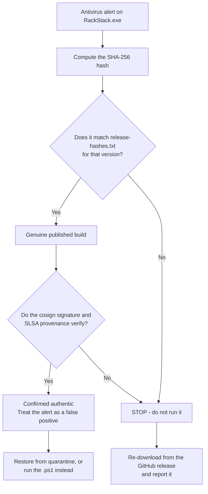

# Antivirus Detections

`RackStack.exe` is periodically flagged by machine-learning and heuristic antivirus engines.
These are false positives. This page explains why they happen, how to **prove for yourself** that
the binary you hold is the genuine published release, and what to do about the alert.

If you arrived here from a VirusTotal result or a quarantine notification, start with
[Verify what you have](#verify-what-you-have).

---

## Table of Contents

- [Why it happens](#why-it-happens)
- [Verify what you have](#verify-what-you-have)
- [Telling a false positive from a real problem](#telling-a-false-positive-from-a-real-problem)
- [Restoring from quarantine](#restoring-from-quarantine)
- [Avoiding it entirely: run the script](#avoiding-it-entirely-run-the-script)
- [Reporting a new detection](#reporting-a-new-detection)

---

## Why it happens

Three properties of RackStack combine to score badly with behavioral and static ML classifiers.
All three are inherent to what the tool is and does.

| Property | Why a classifier dislikes it |
|---|---|
| **The EXE is not Authenticode-signed** | No publisher reputation exists to offset a heuristic score. Code-signing certificates that would fix this require a validated legal entity, which this project does not have. |
| **It is a packed script host** | The EXE is a PowerShell script compiled by [ps2exe](https://github.com/MScholtes/PS2EXE) into a .NET assembly. Self-extracting script hosts are strongly associated with malware droppers, which is why detections usually carry `MSIL`, `assembly`, or generic packer labels. |
| **It manages Defender exclusions and services** | RackStack applies Microsoft's own published antivirus exclusion recommendations for Hyper-V, Failover Clustering, and iSCSI/SAN workloads, and can disable optional Windows services. An unsigned packed binary adding its own antivirus exclusions is, behaviorally, the textbook opening move of a dropper. |

The most common result is a **behavioral** detection such as `Behavior:Win32/DefenseEvasion.A!ml`,
which fires on what the running process *does* — not on the file matching anything known. Static
ML verdicts such as `Trojan:Win32/Sabsik.EN.A!ml` come from the same combination of features.

New releases are also **low-prevalence** files, which raises heuristic scores until download
history accumulates.

---

## Verify what you have

Do this first. It settles the question independently of any antivirus verdict.



### 1. Hash

```powershell
(Get-FileHash RackStack.exe -Algorithm SHA256).Hash.ToLower()
```

Compare against `release-hashes.txt`, attached to
[every release](https://github.com/TheAbider/RackStack/releases). The same hash also appears as
`InstallerSha256` in the winget manifest under [`dist/winget/`](../dist/winget/).

### 2. Build provenance

This proves the binary was produced by a specific public CI run, from a specific commit, in this
repository — something malware repackaged by a third party cannot reproduce.

```powershell
gh attestation verify RackStack.exe --owner TheAbider
```

### 3. Sigstore signature

```powershell
cosign verify-blob `
  --certificate RackStack.exe.pem `
  --signature RackStack.exe.sig `
  --certificate-identity-regexp "^https://github.com/TheAbider/RackStack/.github/workflows/ci.yml@refs/heads/master$" `
  --certificate-oidc-issuer https://token.actions.githubusercontent.com `
  RackStack.exe
```

Every release also ships a CycloneDX SBOM. There is no manual or local step anywhere in the
release path — the published EXE is built entirely in GitHub-hosted CI from the public source in
this repository, and the monolithic `.ps1` it was compiled from is published in the same release
so you can read exactly what the EXE does.

---

## Telling a false positive from a real problem

If the hash matches and the attestations verify, the binary is authentic and any detection is a
false positive by definition — whatever it does, it is what the public source does.

When reading a VirusTotal result, the *pattern* of detections matters more than the count:

**Consistent with a false positive**
- Verdicts are generic ML labels — `*.!ml`, `ML.Attribute.*`, `Static AI`, `*.ml.score`,
  `Malicious (high Confidence)`, `Artemis!<hex>`, `Trojan.MSIL.Gen.*`
- Major engines are silent — Kaspersky, ESET, BitDefender, Sophos, Avast/AVG, Malwarebytes,
  Fortinet, Google, CrowdStrike
- The "popular threat label" names a specific malware family that does not match the file's
  actual architecture. This label is chosen by clustering the family strings that detecting
  engines report, so a handful of low-tier engines bucketing every unsigned .NET binary into one
  generic family is enough to produce a frightening headline.

**Worth taking seriously**
- Multiple major engines agree on a specific named family
- The hash does not match `release-hashes.txt`
- `gh attestation verify` or `cosign verify-blob` fails
- The file did not come from the GitHub release, PowerShell Gallery, Scoop, Chocolatey, or winget

---

## Restoring from quarantine

Only after you have verified the hash and attestations above.

If the tool was quarantined **mid-run**, some configuration may have been applied and some not.
Check the action history and undo state before continuing:

```
%ProgramData%\RackStack\state\
```

Then restore and exclude, from an elevated PowerShell session:

```powershell
# See what was quarantined
Get-MpThreat | Select-Object ThreatName, Resources

# Restore it (substitute the ThreatName reported above)
& "$env:ProgramFiles\Windows Defender\MpCmdRun.exe" -Restore -Name "Behavior:Win32/DefenseEvasion.A!ml"

# Exclude the location you run it from
Add-MpPreference -ExclusionPath 'C:\Path\To\RackStack.exe'
```

> Adding an antivirus exclusion reduces your security posture. Scope it to the specific file
> path, not a whole drive, and remove it when you are finished.

---

## Avoiding it entirely: run the script

The monolithic `RackStack v{version}.ps1` published in every release is the *same code* the EXE
is compiled from. It is unpacked, it is cosign-signed like every other release artifact, and it
is never scored by the PE classifiers that produce these detections.

```powershell
Set-ExecutionPolicy -ExecutionPolicy Bypass -Scope Process
& '.\RackStack v{version}.ps1'   # substitute the version you downloaded
```

The PowerShell Gallery module (`Install-Module RackStack`) is another script-based route that
avoids the packed binary.

If antivirus alerts are a recurring problem in your environment, prefer one of these.

---

## Reporting a new detection

False-positive clearances granted by antivirus vendors are **per file hash**, so a detection can
reappear on a new release even after a previous one was cleared. Reports are genuinely useful.

Please [open an issue](https://github.com/TheAbider/RackStack/issues) with:

- The RackStack version and the SHA-256 you computed
- The engine and the exact detection name
- Whether it was a static scan or fired while the tool was running
- A VirusTotal link if you have one

Detections are disputed with the vendors as they are reported, with the build provenance and
public source attached as evidence.

---

## Related

- [Security Policy](../SECURITY.md) — release verification and vulnerability reporting
- [Troubleshooting](Troubleshooting.md) — operational issues
